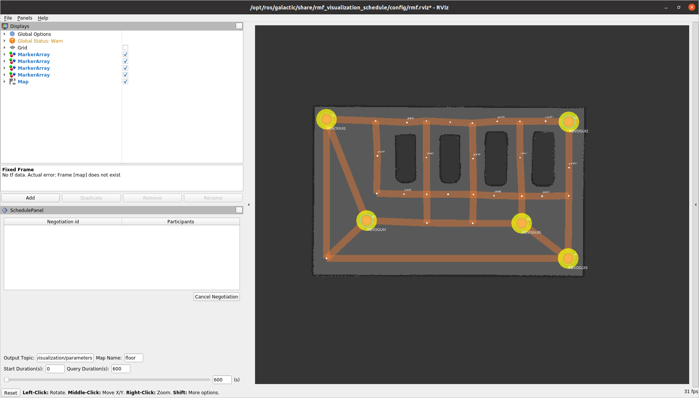

# fleet-adapter

Launch fleet-adapter.  This step adds new elements at the visualization that is started with rmf-core.

## Configuration

The following environment variables are used on the docker image:

You can configure it throught the docker-compose file

```yaml
---
name: fleet-adapter
services:
  adapter:
    image: fleet-adapter:humble-devel
    environment:
      FLEET_CONFIG_FILE: /home/robot/config/config_robotnik_fleet.yaml
      GRAPH_CONFIG_FILE: /home/robot/graph/0.yaml
```

## Image build

```bash
git clone git@github.com:RobotnikIstobalAI2/fleet-adapter.git
cd fleet-adapter
git checkout 0.2.0
cd container/builder
docker compose build
cd ..
```

## Launch docker with fleet-adapter

```bash
docker compose up
```

<p align="center">
  
</p>