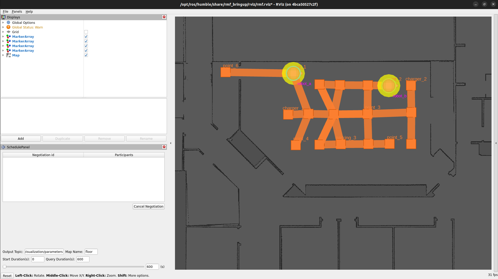

# robotnik_rmf_fleet_adapter

The Robotnik Fleet Adapter for the Open RMF serves to connect the specific API of the Robotnik robotic fleet with the interfaces of the central RMF system, enabling the traffic negotiation. Consequently, it is responsible for managing communication between the fleet and the several interfaces of the OpenRMF infrastructure.

Launch the `robotnik_rmf_fleet_adapter` adds new elements at the visualization which is started with the `rmf-core`.

## Configuration

The `environment` folder, located at `container/environment`, contains all the files with the environment variables used on the docker images.
You can configure them.

The ([adapter_config_files.env](./container/environment/fleet_adapter/adapter_config_files.env)) contains the following configurable environment variables:

| Environment         | Default Value                                   | Meaning                                         |
| ------------------- | ----------------------------------------------- | ----------------------------------------------- |
| `FLEET_CONFIG_FILE` | `/home/robot/config/config_robotnik_fleet.yaml` | Path to the fleet configuration file            |
| `GRAPH_CONFIG_FILE` | `/home/robot/graph/0.yaml`                      | Path to the navigation graph configuration file |


## Image build

```bash
git clone git@github.com:RobotnikIstobalAI2/robotnik_rmf_fleet_adapter.git
cd robotnik_rmf_fleet_adapter
git checkout humble-devel
cd container/builder
docker compose build
cd ..
```

## Launch docker with robotnik_rmf_fleet_adapter

```bash
docker compose up -d
```
<p align="center">
  
</p>